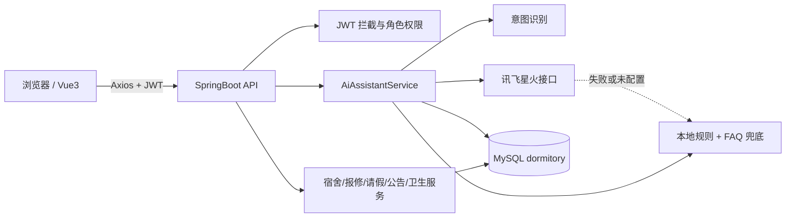
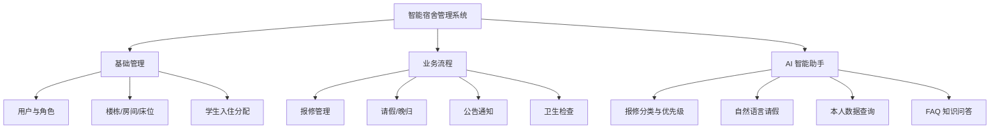
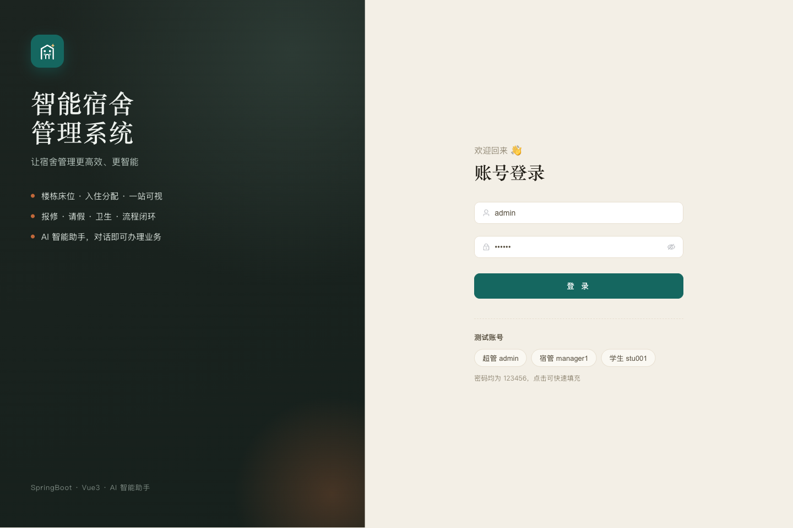
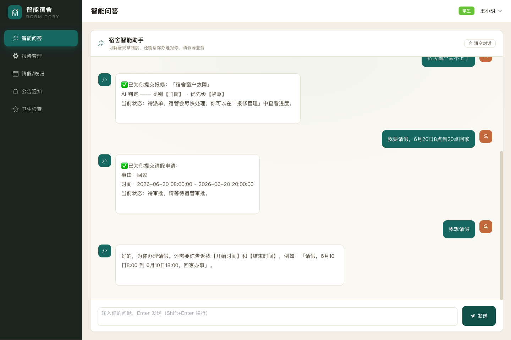
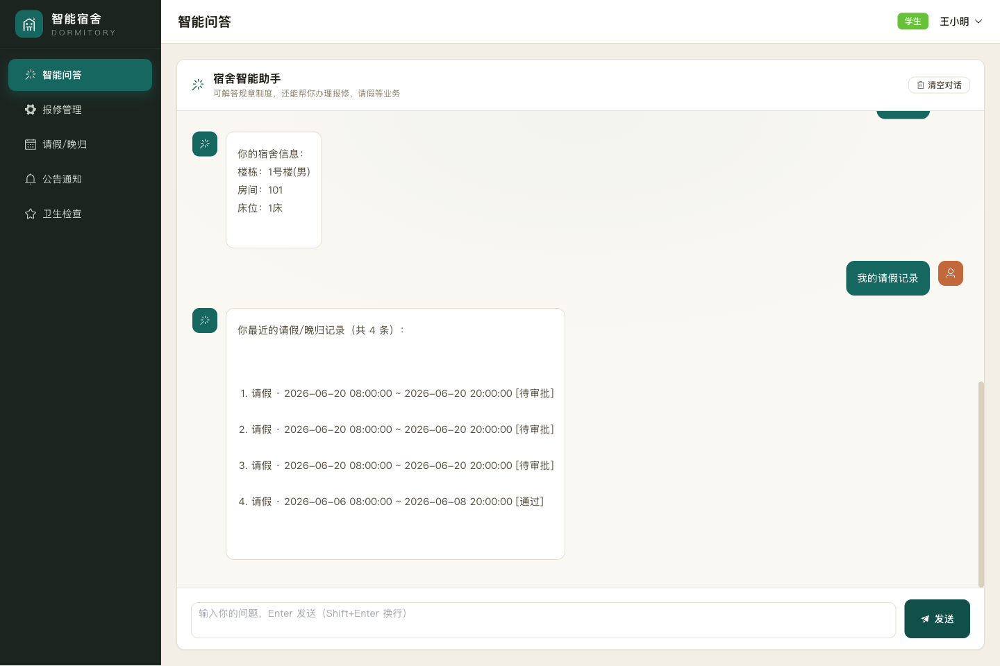
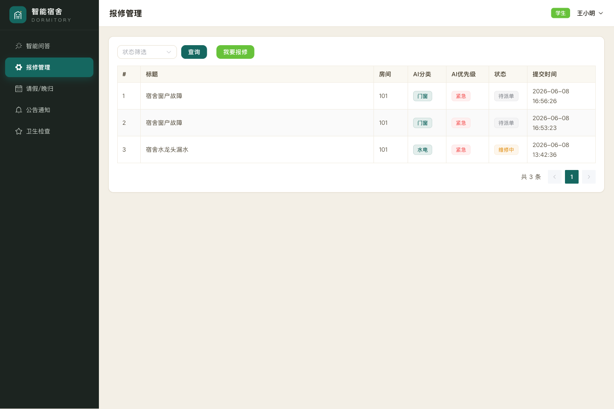

# 智能宿舍管理系统（SpringBoot + Vue3 + 讯飞星火AI）

<!-- open-source-intro-start -->
> **作者寄语**
> 
> 主包是 02 年的，15 岁开始学习计算机，17 岁入行。虽然没有上过大学，但已经帮助很多人顺利毕业和就业。开源这些项目，希望能帮助到你们，也顺便推荐我的论文 AI 工具。如果对主包感兴趣，可以在抖音搜索：迷人闹；如果想学习 AI 编程或需要辅导，也可以联系主包。
> 
> **论文/毕设画图工具推荐：** [毕业论文画图助手](https://gitee.com/chenmin_1_2857135639/bishelunwen) 支持架构图、流程图、ER 图、业务流程图等，适合配合本项目完成论文和答辩材料。
<!-- open-source-intro-end -->

<!-- third-party-api-start -->
## 第三方 API 配置说明

### 讯飞星火（Spark Chat Completions）

- 用途：用于 AI 生成、错题解析、学习建议或智能业务助手等功能。
- 官方接口文档：<https://www.xfyun.cn/doc/spark/Web.html>
- 开放平台/控制台：<https://console.xfyun.cn/>
- 获取方式：注册讯飞开放平台账号，创建或开通星火大模型应用，在应用凭据页获取 APIKey 和 APISecret，按 `APIKey:APISecret` 的格式组合为 APIPassword。
- 环境变量：`SPARK_API_PASSWORD=your_api_key:your_api_secret`，可选 `SPARK_API_URL=https://spark-api-open.xf-yun.com/v1/chat/completions`、`SPARK_MODEL=generalv3`。

> 注意：不要把真实 API Key、Secret、Token 提交到代码仓库。开源示例只保留占位值，本地运行时再写入 `.env` 或系统环境变量。
<!-- third-party-api-end -->


一个面向毕业设计/课程设计的智能宿舍管理系统，覆盖楼栋房间床位、学生入住、报修、请假/晚归、公告、卫生检查、数据看板和 AI 智能助手。项目核心亮点是把自然语言 AI Agent 融入宿舍业务：学生可以直接说“宿舍窗户关不上了”“我要请假，6月20日8点到20点回家”，系统会自动识别意图、校验信息并落入真实业务表。

## 功能模块

| 角色 | 功能 |
| --- | --- |
| 超级管理员 | 用户管理、楼栋/房间/床位、学生入住分配、FAQ、数据看板、全部业务 |
| 宿管员 | 报修派单与完成、请假审批、公告、卫生检查、数据统计 |
| 学生 | AI 助手、提交报修、在线请假/晚归、查看公告/卫生、个人信息 |

### AI 场景

| 用户输入 | 系统动作 |
| --- | --- |
| `宿舍窗户关不上了` | 自动提交报修，分类为门窗，优先级为紧急 |
| `我要请假，6月20日8点到20点回家` | 解析起止时间并提交请假申请 |
| `我想请假` | 追问开始/结束时间，不会创建空申请 |
| `查我的报修` / `我住哪` / `我的请假记录` | 查询本人业务数据并友好返回 |
| `宿舍能用电磁炉吗` | 回退 FAQ 知识库，回答用电安全规则 |

AI 调用优先走讯飞星火 OpenAI 兼容接口；当 `SPARK_API_PASSWORD` 未配置、额度不足或网络异常时，系统会使用本地规则和 FAQ 兜底，保证报修、请假、查询等核心流程仍可演示和复测。

## 技术栈

| 层 | 技术 |
| --- | --- |
| 后端 | JDK8 · SpringBoot 2.7 · MyBatis-Plus 3.5 · MySQL 8 · Druid · JWT · Knife4j · OkHttp · Hutool |
| 前端 | Vue3 · Vite · Element Plus · Pinia · Vue Router · Axios · ECharts |
| AI | 讯飞星火 OpenAI 兼容 HTTP 接口，可用本地规则/FAQ 兜底 |
| 演示 | Playwright 截图 · Remotion 视频 |

## 系统结构

```text
dormitory/
├── dormitory-backend/          # SpringBoot 后端
│   └── src/main/
│       ├── java/com/dormitory/
│       │   ├── ai/             # SparkClient、SparkService、AiAssistantService
│       │   ├── controller/     # 认证、AI、报修、请假、宿舍等接口
│       │   ├── service/        # 业务服务
│       │   ├── mapper/         # MyBatis-Plus Mapper
│       │   └── entity/         # 数据库实体
│       └── resources/
│           ├── application.yml
│           └── db/dormitory.sql
├── dormitory-frontend/         # Vue3 前端
│   └── src/{api,router,store,views,layout,components}
├── demo-video/                 # Remotion 演示视频工程
├── docs/
│   ├── screenshots/            # 发布截图
│   └── dormitory-ai-demo.mp4   # 演示视频
└── scripts/smoke-ai-flow.mjs   # AI 业务 smoke 测试
```

## 架构图



## 功能模块图



## 截图与视频

演示视频：[docs/dormitory-ai-demo.mp4](docs/dormitory-ai-demo.mp4)

| 登录 | AI 办理业务 |
| --- | --- |
|  |  |

| AI 查询/FAQ | 报修记录 |
| --- | --- |
|  |  |

## 快速启动

### 1. 导入数据库

```bash
mysql -uroot -p < dormitory-backend/src/main/resources/db/dormitory.sql
```

默认库名为 `dormitory`。如果数据库账号不是 `root/root`，用环境变量覆盖：

```bash
export DB_HOST=localhost
export DB_PORT=3306
export DB_NAME=dormitory
export DB_USERNAME=root
export DB_PASSWORD=root
```

### 2. 配置 AI（可选）

复制 `.env.example` 或直接设置环境变量：

```bash
export JWT_SECRET=replace-with-a-long-random-secret
export SPARK_API_PASSWORD=你的APIPassword
export SPARK_MODEL=lite
```

`SPARK_API_PASSWORD` 不配置时，系统仍会使用本地意图识别和 FAQ 兜底，适合离线答辩演示。

### 3. 启动后端

```bash
cd dormitory-backend
mvn spring-boot:run
```

接口地址：`http://localhost:8088/api`
接口文档：`http://localhost:8088/api/doc.html`

### 4. 启动前端

```bash
cd dormitory-frontend
npm install
npm run dev
```

访问：`http://localhost:5174`

## 测试账号

密码均为 `123456`。

| 角色 | 账号 |
| --- | --- |
| 超级管理员 | `admin` |
| 宿管员 | `manager1` / `manager2` |
| 学生 | `stu001` ~ `stu005` |

## 测试与验证

后端：

```bash
cd dormitory-backend
mvn test
```

前端：

```bash
cd dormitory-frontend
npm run build
```

AI 业务 smoke：

```bash
node scripts/smoke-ai-flow.mjs
```

该脚本会验证自动报修、完整请假、不完整请假追问、本人数据查询和 FAQ 问答。

Remotion 演示视频：

```bash
cd demo-video
npm install
npm run lint
npx remotion render MyComp ../docs/dormitory-ai-demo.mp4 --codec=h264 --crf=20
```

## 开源说明

- 配置密钥请使用环境变量或本地 `.env`，不要提交真实 `SPARK_API_PASSWORD`、数据库密码或 JWT 密钥。
- `.env.example` 只提供占位示例。
- 演示截图与视频位于 `docs/`，中间帧与依赖目录已加入 `.gitignore`。

## 相关项目

- [毕业论文画图助手](https://gitee.com/chenmin_1_2857135639/bishelunwen)：适合为毕业论文补充 ER 图、流程图、架构图等配套图形。

## License

本项目使用 MIT License，详见 [LICENSE](LICENSE)。
